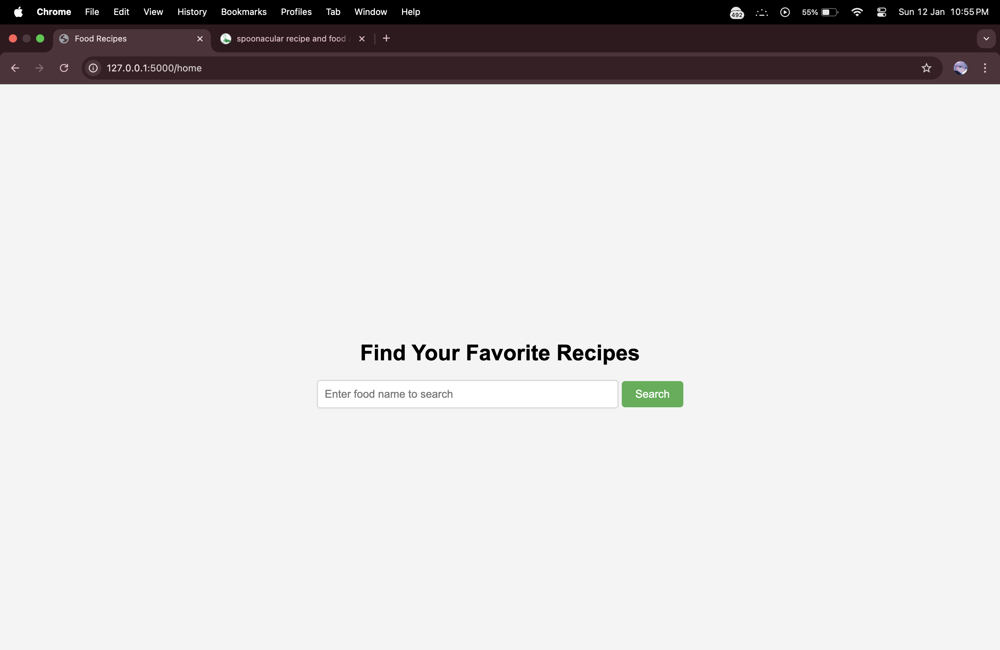
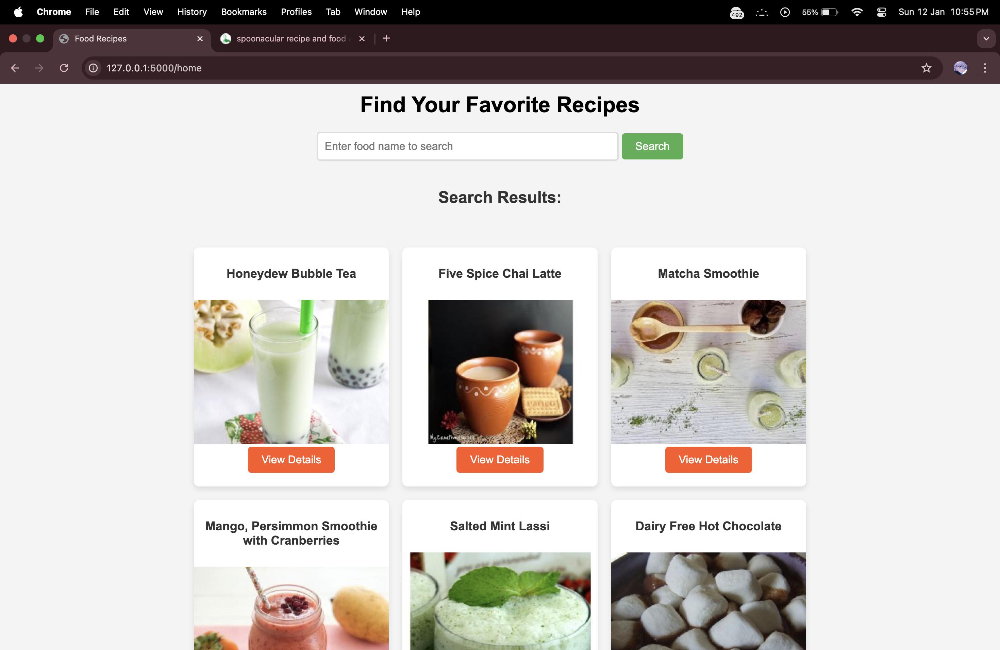
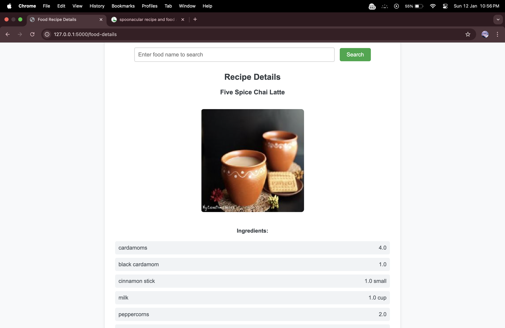
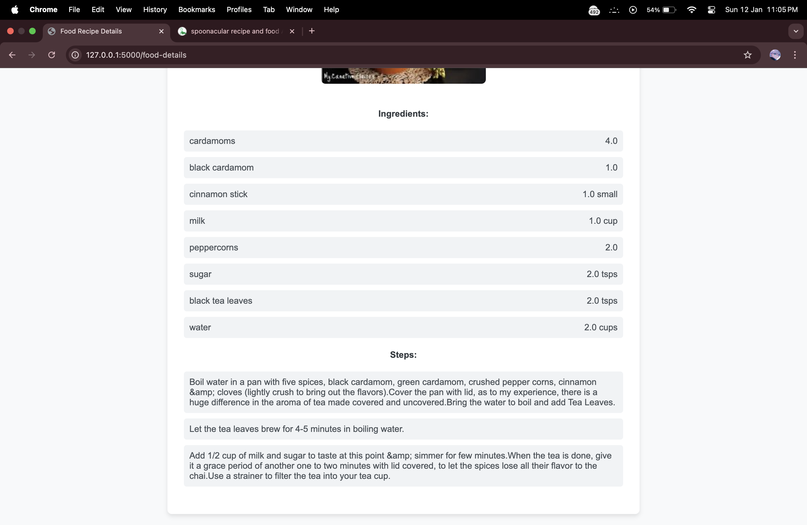

# Food Recipes Web Application

## Overview
The **Food Recipes Web Application** allows users to search for recipes by food name and view detailed information about the recipes, including ingredients, preparation steps, and images.

## Features
- Search for recipes by entering a food name.
- View a list of recipes with images and titles.
- Access detailed recipe information including:
  - Ingredients with their quantities and units.
  - Step-by-step preparation instructions.
- User-friendly interface with clean design.

## Project Directory Structure
```
rahil71-food-recipes/
├── app.py              # Main Flask application
├── test.py             # Placeholder for testing (optional)
├── static/             # Static files (CSS, images, etc.)
│   ├── details.css     # CSS for the recipe details page
│   ├── index.css       # CSS for the main index page
│   └── git-images/     # Images used in the GitHub repository (e.g., screenshots)
└── templates/          # HTML templates
    ├── details.html    # Template for recipe details page
    └── index.html      # Template for the main search page
```

## Technologies Used
- **Backend**: Flask (Python)
- **Frontend**: HTML, CSS
- **API Integration**: Spoonacular API for fetching recipe data

## Setup and Installation
1. Clone the repository:
   ```bash
   git clone https://github.com/Rahil71/Food-Recipes.git
   ```
2. Navigate to the project directory:
   ```bash
   cd rahil71-food-recipes
   ```
3. Create a virtual environment:
   ```bash
   python3 -m venv venv
   source venv/bin/activate  # On Windows: venv\Scripts\activate
   ```
4. Install dependencies:
   ```bash
   pip install flask python-dotenv requests
   ```
5. Obtain an API key from the [Spoonacular API](https://spoonacular.com/food-api).
6. Create a `.env` file in the root directory and add your API key:
   ```
   Spoonacular_API_KEY=your_api_key_here
   ```
7. Run the application:
   ```bash
   python app.py
   ```
8. Open your browser and navigate to `http://127.0.0.1:5000/home`.

## How to Use
1. Enter a food name in the search bar and click the **Search** button.
2. View the list of matching recipes.
3. Click **View Details** to see the recipe's ingredients and preparation steps.

## Screenshots
### Home Page



### Recipe Details Page



## Contributions
Contributions are welcome! Please follow these steps:
1. Fork the repository.
2. Create a new branch:
   ```bash
   git checkout -b feature-name
   ```
3. Make your changes and commit them:
   ```bash
   git commit -m "Description of changes"
   ```
4. Push to the branch:
   ```bash
   git push origin feature-name
   ```
5. Submit a pull request.

## License
This project is open-source and available under the [MIT License](LICENSE).

## Contact
For any queries, reach out to [Rahil71](https://github.com/Rahil71).

